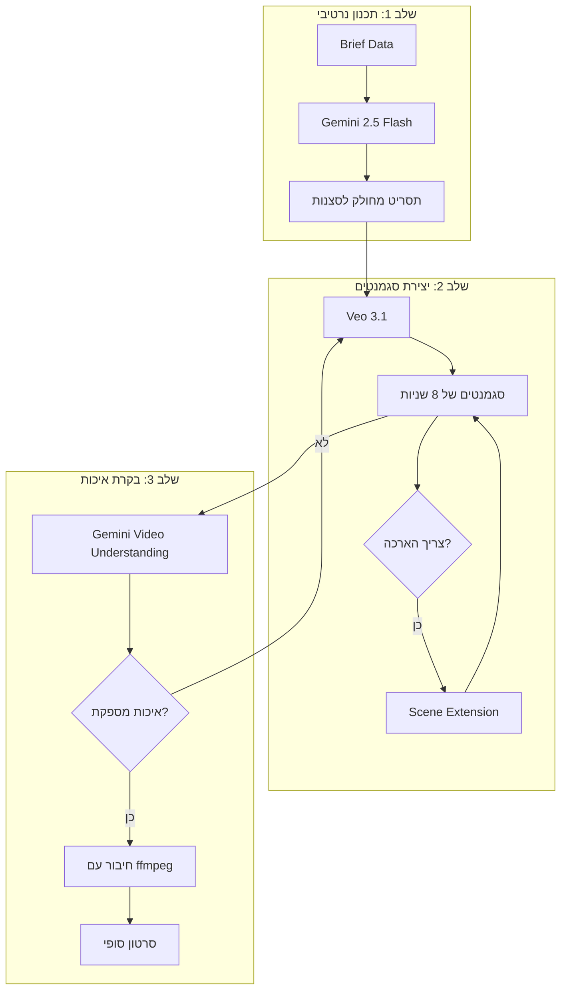

# אינטגרציית Google AI Studio לסרטונים ארוכים

## מצב נוכחי

הפרויקט כבר תומך ב:

- יצירת סרטונים קצרים (5-10 שניות) עם Runway ML
- מודל `Scene` ב-Schema (כבר קיים!)
- שדות `totalScenes`, `completedScenes` במודל Video
- צ'אט בעברית עם 9 שלבים

## ארכיטקטורת ה-Pipeline



## שינויים נדרשים

### 1. קובץ חדש: `src/lib/google-ai.ts`

אינטגרציה עם `@google/genai` SDK:

```typescript
// פונקציות עיקריות
planVideoScenes(briefData) -> ScenePlan[]
generateVideoSegment(prompt, referenceImages?) -> taskId
extendVideoScene(videoUrl, duration) -> taskId
analyzeVideoQuality(videoUrl, expectedPrompt) -> QualityResult
```

### 2. עדכון Schema: `prisma/schema.prisma`

הוספת שדות למודל Video:

```prisma
model Video {
  // שדות קיימים...
  
  // שדות חדשים לסרטונים ארוכים
  videoType      VideoType  @default(SHORT) // SHORT | LONG
  pipelineStage  String?    // PLANNING | GENERATING | QA | JOINING | DONE
  scriptData     Json?      // תסריט מלא מ-Gemini
}

enum VideoType {
  SHORT
  LONG
}
```

עדכון מודל Scene (כבר קיים, צריך להוסיף שדות):

```prisma
model Scene {
  // שדות קיימים...
  
  // שדות חדשים
  sceneDescription  String?   // תיאור הסצנה מהתסריט
  qualityScore      Float?    // ציון איכות מ-Gemini
  retryCount        Int       @default(0)
  referenceImages   Json?     // תמונות ייחוס
}
```

### 3. API Routes חדשים

| Route | תיאור |

|-------|-------|

| `POST /api/videos/[id]/generate-long` | התחלת Pipeline סרטון ארוך |

| `GET /api/videos/[id]/scenes` | קבלת סטטוס כל הסצנות |

| `POST /api/videos/[id]/scenes/[sceneId]/regenerate` | יצירה מחדש של סצנה |

| `GET /api/videos/[id]/pipeline-status` | SSE לסטטוס Pipeline מלא |

### 4. עדכון ה-Chat Flow

הוספת שלב 10 ל-[`src/lib/prompts/system-prompt.ts`](src/lib/prompts/system-prompt.ts):

```
שלב 10: בחירת אורך סרטון
- אם ארוך: שאלות נוספות על סצנות ומסרים
- Trigger: [TRIGGER:VIDEO_LENGTH_SELECTOR]
```

### 5. קומפוננטות UI חדשות

| קומפוננט | תיאור |

|----------|-------|

| `video-length-selector.tsx` | בחירה בין סרטון קצר/ארוך |

| `scene-timeline.tsx` | Timeline ויזואלי של הסצנות |

| `scene-preview.tsx` | תצוגה מקדימה של סצנה בודדת |

| `long-video-progress.tsx` | מעקב התקדמות Pipeline מלא |

### 6. Prompts חדשים ב-`src/lib/prompts/`

| קובץ | תיאור |

|------|-------|

| `narrative-planning.ts` | Prompt לתכנון תסריט עם Gemini |

| `scene-prompt.ts` | Prompt ליצירת סצנה בודדת עם Veo |

| `quality-check.ts` | Prompt לבקרת איכות עם Gemini Video |

### 7. שירות חיבור סגמנטים

אפשרויות:

- **Option A**: ffmpeg בשרת (דורש binary)
- **Option B**: Cloudinary Video Concatenation API
- **Option C**: שירות חיצוני כמו Creatomate

## משתני סביבה חדשים

```env
GOOGLE_AI_API_KEY=...  # Google AI Studio API Key
```

## סדר מימוש מומלץ

### Phase 1: תשתית (1-2 ימים)

1. התקנת `@google/genai` SDK
2. יצירת `google-ai.ts` עם פונקציות בסיסיות
3. עדכון Schema + מיגרציה

### Phase 2: Pipeline (2-3 ימים)

4. מימוש תכנון נרטיבי (Gemini)
5. מימוש יצירת סגמנטים (Veo 3.1)
6. מימוש בקרת איכות (Gemini Video)
7. API Routes חדשים

### Phase 3: Chat Flow (1 יום)

8. עדכון System Prompt
9. הוספת video-length-selector widget
10. עדכון brief-summary לתמיכה בסרטונים ארוכים

### Phase 4: UI (1-2 ימים)

11. Scene Timeline component
12. Long Video Progress component
13. עדכון video player לסרטונים ארוכים

### Phase 5: חיבור ואינטגרציה (1 יום)

14. חיבור סגמנטים (ffmpeg/Cloudinary)
15. בדיקות end-to-end
16. אופטימיזציות

## הערות חשובות

1. **עלות**: Veo 3.1 עולה ~$0.75 לשנייה, סרטון של דקה = ~$50
2. **זמן יצירה**: Pipeline מלא יכול לקחת 10-20 דקות
3. **Retry Logic**: סצנה שנכשלת נוצרת מחדש עד 3 פעמים
4. **Backwards Compatibility**: סרטונים קצרים ימשיכו לעבוד עם Runway